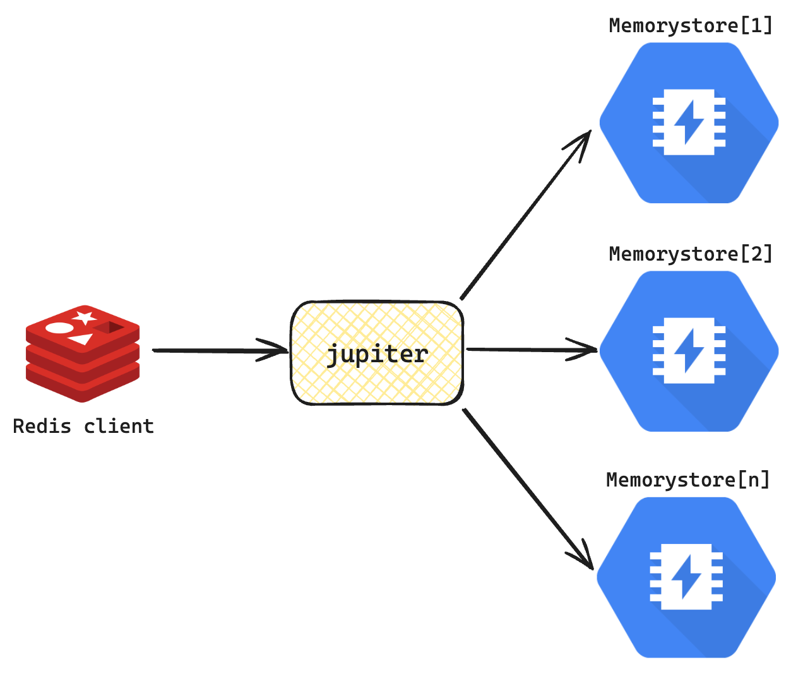

**Deprecated**

`jupiter` is our custom, highly-scalable [Redis](https://redis.io/) mini-clone specifically designed as cache for our graph and reports data. It acts as a proxy to a cluster of Redis (in our case, [Memorystore](https://cloud.google.com/memorystore)) nodes and handles load distribution using [consistent hashing](https://en.wikipedia.org/wiki/Consistent_hashing). Sort of similar to [Envoy Redis proxy](https://www.envoyproxy.io/docs/envoy/latest/intro/arch_overview/other_protocols/redis). It supports (WIP) dynamic addition and removal of Redis nodes with minimal interruptions.

<p align="center">
  
</p>

`jupiter` is not a Redis replacement, although it is compatible with most Redis clients such as [`redigo`](https://github.com/gomodule/redigo) and [`go-redis`](https://github.com/redis/go-redis). It is a best-effort caching system, prioritizing availability over consistency.

There is a slight performance penalty over direct connections to Redis due to its use of hashing; it requires all commands to have a key as hash to find the corresponding Redis node. If you require high performance caching, you're probably better off using a dedicated Redis node/cluster.

### Why

The main reason why `jupiter` exists is that at the time of this writing, the maximum Memorystore instance available in GCP is 300GB. Beyond this, we need to create more instances. Instead of leaving the responsibility of accessing multiple Memorystore instances to our applications, it's more convenient to be able to access these clusters of instances as a single entity. After a trial run with [Envoy Redis proxy](https://www.envoyproxy.io/docs/envoy/latest/intro/arch_overview/other_protocols/redis), we wanted something more, especially the ability to add/remove instances seamlessly with minimal interruptions to our client applications. [Redis Ring](https://redis.uptrace.dev/guide/ring.html) was also considered but we wanted more control and flexibility on the control plane side.

### Hashing

Most of the "caching" commands in Redis need a key (usually `args[1]`, or the argument after the command itself). `jupiter` will try to use this argument as the default hashing key. This renders some other Redis commands unsupported, such as cluster commands, Pub/Sub, transactions, LUA scripting, etc. However, `jupiter` also provides a custom way to input a (or override the) hashing key if needed **using the last argument**.

Adding the `hash={key}` argument at the end of a command tells `jupiter` to use `{key}` as the hash key. This argument won't be included in the final Redis command that is submitted to the target node.

For example:

```sh
# Use 'somekey' as the hashing key.
redis> SET hello world hash=somekey
redis> GET hello hash=somekey

# Here, jupiter will use 'hello' as the hashing key.
redis> SET hello world
redis> GET hello

# For scans, you most definitely want to provide the hash.
redis> MSET key1 val1 key2 val2 key3 val3 hash=somekey
"OK"
redis> SCAN 0 MATCH key* hash=somekey
1) "0"
2) 1) "key3"
   2) "key2"
   3) "key1"
```

Finally, `jupiter` will use a random hash key if none is detected/provided. For example, commands with no arguments such as `DBSIZE`, `TIME`, `RANDOMKEY`, etc.

### Usage

Using [`go-redis`](https://github.com/redis/go-redis) (recommended):

```go
// You can use the `jupiter` package in ouchan:
import (
    ...
    "github.com/mobingilabs/ouchan/pkg/jupiter"
)

jupiter.Init()
...
ctx := context.Background()
_, err := jupiter.Client().Set(ctx, "key", "value", time.Second*10).Result()
if err != nil {
    // failed
} else {
    // ok
}
```

Using [`redigo`](https://github.com/gomodule/redigo):

```go
import (
    ...
    "github.com/gomodule/redigo/redis"
)

hashKey := "hash=sample/hashkey"
pool := &redis.Pool{
    MaxIdle:     3,
    MaxActive:   100,
    IdleTimeout: 240 * time.Second,
    Dial: func() (redis.Conn, error) {
        return redis.Dial("tcp", "jupiter-redis.default.svc.cluster.local:6379")
    },
}

con := pool.Get()
defer con.Close()
v, err := redis.String(con.Do("PING", hashKey))
if err != nil {
    log.Printf("PING failed: %v", err)
} else {
    log.Printf("reply=%v", v)
}
```

### Try it out (internal)

If you want to try `jupiter` using `redis-cli`, you can do so by:

```sh
# Do a port-forward of the prod service to your local (separate terminal):
$ brew install flowerinthenight/tap/kubepfm
$ kubepfm --target service/jupiter-redis:6379:6379

# Connect redis-cli to the forwarded port (separate terminal):
$ redis-cli
127.0.0.1:6379> PING hash=somekey
"PONG"
127.0.0.1:6379> quit
```

### Limitations

Pipelining and transactions are not supported as `jupiter` doesn't guarantee the use of a single connection for multiple, related commands (i.e. `MULTI`, `...`, `EXEC`), even if the same hash key is provided. We might support these in future versions.

### Notes

`jupiter` is a very GCP-centric system; it uses [`hedge`](https://github.com/flowerinthenight/hedge) as its cluster coordinator which requires [Cloud Spanner](https://cloud.google.com/spanner).
